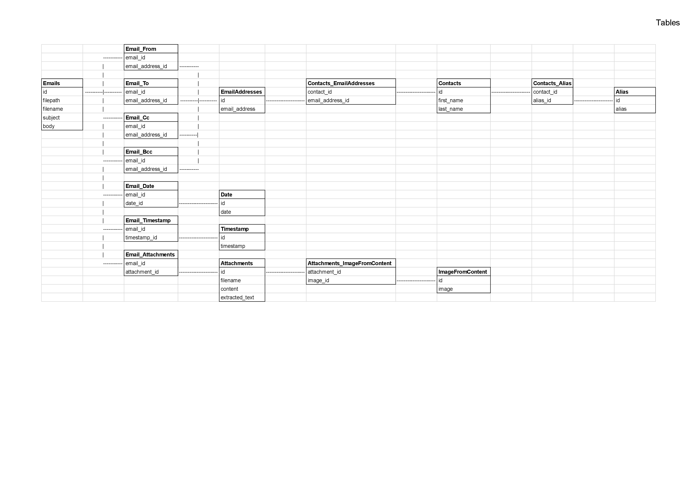

# MessageTrackPro_v2
Revolutionize your communications management with Message Track Pro 
Status: `in progress` 

## Update
- **23/07/2024**: Created a list of dictionaries with `EmailProcessing` containing all emails
- **23/07/2024**: Created a class `EmailDatabase` for managing DB access
- **23/07/2024**: Developed code for inserting emails into the DB

## Next tasks
1. Retrieve email data from the DB
_____________________________________________________________________
# Implementation overview
## Emails management
- [X] Extract datas from eml file
- [X] Transform datas
- [X] Load data email into DB
- [ ] Retrive email data from DB
- [ ] Filter for advanced searching
- [ ] Manage attachment files

## Sms / Mms managment
- [ ] *not yet implemented*

## Call managment
- [ ] *not yet implemented*

## Messenger managment (Facebook)
- [ ] *not yet implemented*

_____________________________________________________________________
# Docs
## Tables

## Join

## Where
